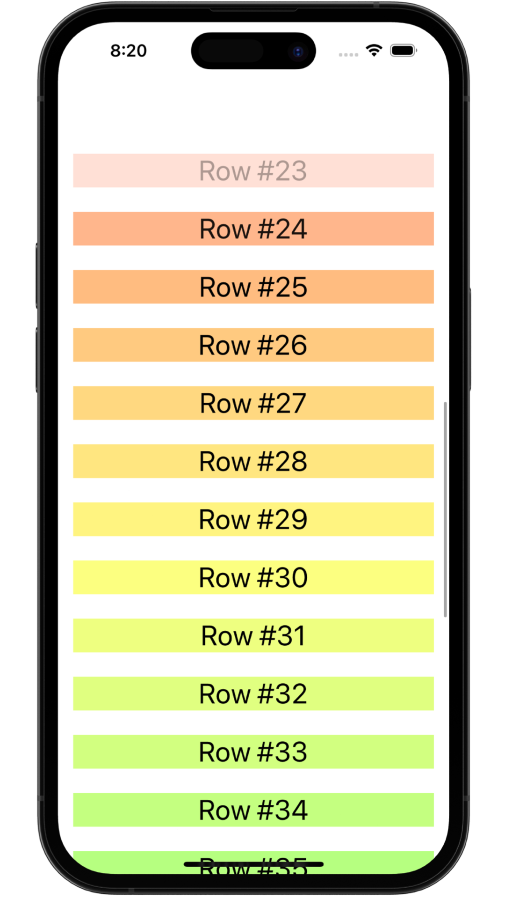

#   📱 Layout and Geometry 

### Project 18
##### Author: *[MatviiArtemenko](https://github.com/100DaysOfSwiftUI-MatviiArtemenko)*

##### 100DaysOfSwiftUI form *[@twostraws](https://twitter.com/twostraws "twostraws twitter page")*

##### Follow along: *[100DaysOfSwiftUI](https://www.hackingwithswift.com/100/swiftui "Hacking with Swift")*

---

> *As for `GeometryReader`, it’s one of those things you can get by perfectly fine without even thinking about, and that’s fine. But when you want to add a little pizazz to your designs – when you want to really bring something to life as the user interacts with it – `GeometryReader` is a fast and flexible fix that offers a huge amount of power in only a handful of lines of code.*

---

##   📚 Covered topics

GeometryReader, Color()

---
##   🖠Challenge
* [x] Make views near the top of the scroll view fade out to 0 opacity – I would suggest starting at about 200 points from the top.

* [x] Make views adjust their scale depending on their vertical position, with views near the bottom being large and views near the top being small. I would suggest going no smaller than 50% of the regular size.

* [x] For a real challenge make the views change color as you scroll. For the best effect, you should create colors using the `Color(hue:saturation:brightness:)` initializer, feeding in varying values for the hue.
 

---
## &nbsp; 📲 Screenshoot

  
  

---
##  &nbsp; 🔍 &nbsp; Resources 

* [Apple documentation - Geometry Reader](https://developer.apple.com/documentation/swiftui/geometryreader/)

